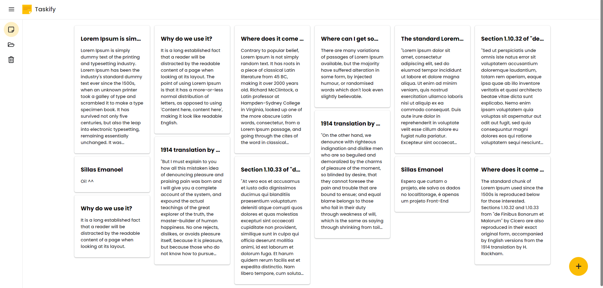

<h1 align="center"> Taskify </h1>



O Taskify é um sistema de anotações simples e intuitivo, projetado para ajudar os usuários a criar, arquivar e excluir notas de forma rápida e fácil. Com foco na praticidade, o Taskify permite que você registre e gerencie suas anotações de maneira eficiente, garantindo uma organização eficaz das informações importantes. É a ferramenta ideal para lembrar tarefas e manter-se organizado de maneira descomplicada.

## Tecnologias

- React
- Styled-Components
- LocalStorage

## Como Utilizar

1. **Clone o Repositório:**
```bash
git clone https://github.com/sillasemanoel/taskify.git
```

2. **Instale as Dependências:**
```bash
cd taskify
npm install
```

3. **Inicie o Servidor de Desenvolvimento:**
```bash
npm run dev
```

## Contribuindo

Contribuições são bem-vindas! Se você deseja melhorar o Taskify, corrigir bugs, adicionar recursos ou melhorar a documentação, sinta-se à vontade para abrir um Pull Request explicando suas mudanças.

## Contato

Se você tiver alguma dúvida, sugestão ou problema com o Taskify, sinta-se à vontade para entrar em contato comigo sillasemanoel116@gmail.com

## Licença

Este projeto está licenciado sob a Licença MIT - veja o arquivo [LICENSE](./.github/license.txt) para mais detalhes.

---

Esperamos que o Taskify torne sua experiência de gerenciamento de anotações mais fácil e produtiva. Agradeço por utilizar o Taskify e fico à disposição para ajudá-lo em caso de qualquer dúvida. Mantenha-se organizado e produtivo!
